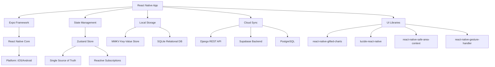
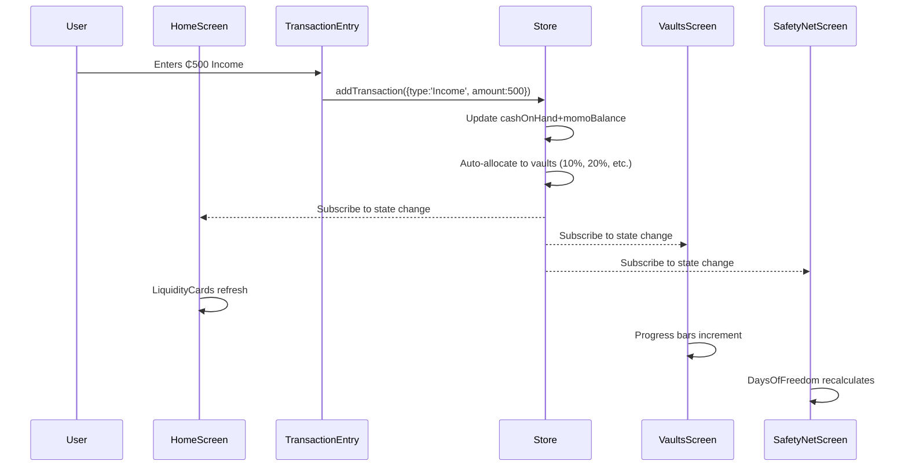
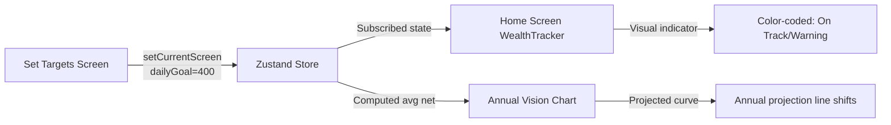
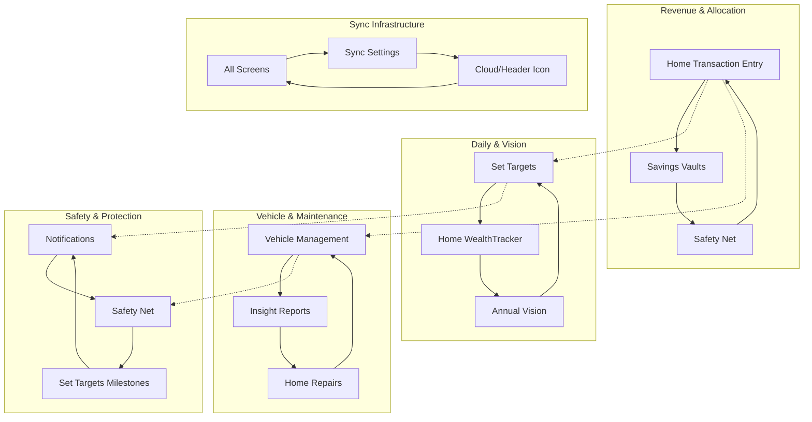

# Prosper Mobile - System Architecture & Analysis

## Executive Summary

**Prosper** is an offline-first financial operating system for professional drivers, built with React Native (Expo) and a reactive Zustand state management layer. The architecture follows a **hub-and-spoke model** where the central store acts as the single source of truth, broadcasting state changes to all subscribed UI components.

**Architecture Style:** Unidirectional Data Flow (Flux-like) with Centralized State  
**Key Principle:** Every screen is both a consumer and producer of state changes, creating a Continuous Data Loop.

---

## 1. High-Level System Architecture

```
┌─────────────────────────────────────────────────────────────┐
│                        USER INTERFACE LAYER                 │
├─────────────┬─────────────┬─────────────┬─────────────────────┤
│   Home      │  Annual     │  Vehicle    │   Financial Tips    │
│   Screen    │   Vision    │  Management │   (Read-only)       │
├─────────────┴─────────────┴─────────────┴─────────────────────┤
│                      COMPONENT LAYER                         │
│  ┌──────────────┐  ┌──────────────┐  ┌──────────────┐      │
│  │  Header      │  │  SideDrawer  │  │  HeroCard    │      │
│  │  Component   │  │  Component   │  │  Component   │      │
│  └──────────────┘  └──────────────┘  └──────────────┘      │
│  ┌──────────────┐  ┌──────────────┐  ┌──────────────┐      │
│  │ Liquidity    │  │  Shift       │  │  Wealth      │      │
│  │  Cards       │  │  Monitor     │  │  Tracker     │      │
│  └──────────────┘  └──────────────┘  └──────────────┘      │
├─────────────────────────────────────────────────────────────┤
│                      STATE LAYER (Zustand)                  │
│  ┌────────────────────────────────────────────────────────┐ │
│  │  useFinanceStore (Single Store of Truth)               │ │
│  │  - Navigation State  - Financial Data                  │ │
│  │  - Business Ops     - Vehicle Data                     │ │
│  │  - Settings         - Notifications                    │ │
│  └────────────────────────────────────────────────────────┘ │
├─────────────────────────────────────────────────────────────┤
│                      PERSISTENCE LAYER                      │
│  ┌─────────────┐         ┌─────────────┐                   │
│  │   MMKV /    │         │   Django    │                   │
│  │  SQLite     │◄───────►│  Backend    │                   │
│  │ (Local)     │  Sync   │  (Cloud)    │                   │
│  └─────────────┘         └─────────────┘                   │
└─────────────────────────────────────────────────────────────┘
```

### Layer Responsibilities

| Layer | Technology | Responsibility |
|-------|-----------|---------------|
| **UI Layer** | React Native, React Native Gesture Handler | Screen components, touch interactions, animations |
| **Component Layer** | Reusable presentational components | Shared widgets (Header, Cards, Inputs) |
| **State Layer** | Zustand | Single source of truth, business logic, cross-screen coordination |
| **Persistence Layer** | MMKV (local), Django + Supabase (cloud) | Offline cache, cloud sync, conflict resolution |

---

## 2. Technology Stack Deep Dive



### Dependency Graph

```
Prosper App (mobile/)
├── State Management
│   └── zustand (4.x)
├── Navigation (Custom)
│   ├── react-native-gesture-handler
│   └── react-native-safe-area-context
├── UI Components
│   ├── react-native (Expo SDK 50+)
│   ├── react-native-gifted-charts (1.x)
│   └── lucide-react-native (0.263+)
├── Local Persistence
│   ├── react-native-mmkv (6.x) — key-value cache
│   └── expo-sqlite (13.x) — relational data
└── Backend Integration
    ├── axios / fetch — HTTP client
    └── supabase-js — real-time sync layer
```

---

## 3. Zustand Store Architecture

### Store Structure

```javascript
useFinanceStore = {
  // ── Navigation & UI State ──────────────────────
  currentScreen: 'Home',          // Active screen identifier
  isDrawerOpen: false,            // Side drawer visibility
  isSynced: true,                 // Cloud sync status
  driverName: 'Alex',             // User profile

  // ── Financial Data ────────────────────────────
  cashOnHand: 0,                  // Physical currency
  momoBalance: 0,                 // Mobile money balance
  safetyNet: 0,                   // Emergency fund
  safetyNetTarget: 5000,          // Emergency fund goal
  dailyGoal: 400,                 // Target daily net profit
  topExpense: { name: '', amount: 0 },

  // ── Allocation Strategy ────────────────────────
  allocations: [
    { id: 1, label: 'Operating Costs', percent: 50, color: '#F59E0B' },
    { id: 2, label: 'Business Growth', percent: 20, color: '#10B981' },
    { id: 3, label: 'Safety Net',     percent: 10, color: '#004D40' },
    { id: 4, label: 'Personal/Home',  percent: 20, color: '#8B5CF6' }
  ],

  // ── Milestone Goals ────────────────────────────
  milestones: [
    { id: 1, name: 'License Renewal', target: 800, current: 350, deadline: '2026-06-15' },
    { id: 2, name: 'New Tire Set',    target: 1200, current: 200, deadline: '2026-08-30' }
  ],

  // ── Business Operations ────────────────────────
  isShiftActive: false,           // Is driver currently working?
  shiftStartTime: null,           // Shift start timestamp
  transactions: [],               // Full transaction history

  // ── Vehicle Data ───────────────────────────────
  maintenanceFund: 850,           // Saved for service
  maintenanceTarget: 2000,        // Service fund goal
  nextServiceKm: 1250,            // km until next service
  vehicleHealthScore: 85,         // 0–100 composite score

  // ── Notifications ──────────────────────────────
  notifications: [],
  unreadCount: 0,

  // ── Actions (Methods) ──────────────────────────
  addTransaction(transaction),
  startShift(),
  endShift(),
  setCurrentScreen(screenName),
  toggleDrawer(),
  setSafetyNet(amount),
  setTargetsSaved({ dailyGoal, allocations, milestones }),
  // ... more actions
}
```

### Store Action Flowchart

```
┌──────────────┐
│  UI Event    │  (e.g., button press, form submit)
│  (Home.js)   │
└──────┬───────┘
       │ dispatch(action)
       ▼
┌──────────────────┐
│  useFinanceStore │
│  .addTransaction │
└──────┬───────────┘
       │ set((state) => { ... })
       ▼
┌──────────────────┐    ┌─────────────────────┐
│  Update State    │───►│  Derive New Values │
│  - cashOnHand    │    │  - vault balances   │
│  - transactions  │    │  - daysOfFreedom    │
│  - isSynced=false│    │  - healthScore      │
└──────────────────┘    └─────────────────────┘
       │                         │
       └──────────┬──────────────┘
                  │ store updated
                  ▼
         ┌─────────────────────┐
         │  React Re-render    │
         │  (All subscribers)  │
         └──────────┬──────────┘
                    │
         ┌──────────┴──────────┐
         │                     │
         ▼                     ▼
┌──────────────┐      ┌───────────────┐
│  Home Screen │      │  Vaults       │
│  updates     │      │  Screen       │
│  balances    │      │  updates      │
└──────────────┘      └───────────────┘
```

---

## 4. Navigation Architecture

### Custom State-Based Navigation

Unlike React Navigation, Prosper uses a **simple conditional render** pattern driven by Zustand state:

**App.js Flow:**
```javascript
const currentScreen = useFinanceStore(state => state.currentScreen);

if (currentScreen === 'AnnualVision') {
  return <AnnualVisionScreen navigation={...} />;
}
if (currentScreen === 'VehicleManagement') {
  return <VehicleScreen navigation={...} />;
}
// ... more screen conditions

return <HomeScreen />; // default
```

### Navigation Tree

```
Home (default)
│
├── Side Drawer (hamburger menu)
│   │
│   ├── Business Section
│   │   ├── Annual Vision         ──┐
│   │   ├── Vehicle Management     ──┤
│   │   └── Insight Reports         │
│   │                                │ navigates by
│   ├── Financial Section           │ setCurrentScreen()
│   │   ├── Financial Tips          ──┤
│   │   ├── Set Targets              │
│   │   ├── Savings Vaults           │
│   │   └── Safety Net              ──┘
│   │
│   └── Settings Section
│       ├── Sync Settings
│       ├── App Settings
│       └── Notifications
│
└── Back Navigation (top-left chevron) → setCurrentScreen('Home')
```

**Key Properties:**
- `currentScreen` — string key mapping to component
- `setCurrentScreen(screenName)` — updates store, triggers re-render
- `SideDrawer` — modal overlay, not a stack navigator

---

## 5. Data Flow Diagrams

### 5.1 Transaction Lifecycle (Income Logging)



### 5.2 Target Update Propagation



### 5.3 Vehicle Health Impact Cascade

```
┌─────────────────────┐
│  Log "Repair" Cost  │
│    on Home Screen   │
└──────────┬──────────┘
           │ addTransaction({category:'Repair', amount:450})
           ▼
┌─────────────────────┐
│   Store Updates     │
│  - transactions[]   │
│  - vehicleHealthScore recalcs │
└──────────┬──────────┘
           │
      ┌────┴─────┐
      │          │
      ▼          ▼
┌─────────┐  ┌───────────────┐
│Vehicle  │  │Notifications  │
│Screen   │  │Screen         │
│- Repair │  │- Alert:      │
│  log    │  │  "Service    │
│  updates│  │   Due"       │
│- Health │  │  triggered   │
│  badge  │  │  if score<70 │
│  color  │  └───────────────┘
└─────────┘
```

---

## 6. Continuous Data Loop Map



---

## 7. Component Dependency Matrix

| Component | Depends On Store Keys | Updates On | Renders When |
|-----------|----------------------|------------|--------------|
| **HomeScreen** | `cashOnHand`, `momoBalance`, `safetyNet`, `isShiftActive`, `topExpense` | `addTransaction`, `startShift` | Any of above changes |
| **Header** | `isSynced`, `unreadCount` | `setSynced`, `addNotification` | Sync status or notification count |
| **SideDrawer** | `currentScreen` | `setCurrentScreen` | Screen name changes |
| **LiquidityCards** | `cashOnHand`, `momoBalance` | `addTransaction`, `topUp` | Balance changes |
| **ShiftMonitor** | `isShiftActive`, `shiftStartTime` | `startShift`, `endShift` | Shift status toggles |
| **ExpenseFocus** | `topExpense.name`, `topExpense.amount` | `addTransaction` (if larger expense) | Top expense updates |
| **WealthTracker** | `cashOnHand`, `momoBalance`, `safetyNet`, `milestones` | All financial actions | Any wealth-affecting change |
| **VehicleScreen** | `maintenanceFund`, `vehicleHealthScore`, `nextServiceKm` | `addTransaction` (Repair/Fuel) | Mileage logged or repair added |
| **SetTargetsScreen** | `dailyGoal`, `allocations`, `milestones` | Local UI state (unsaved) until Save | User adjusts sliders |
| **SavingsVaultsScreen** | Vault balances from store | `addTransaction` (auto-allocate) | Income logged or manual transfer |
| **SafetyNetScreen** | `safetyNet`, `safetyNetTarget` | `addTransaction`, manual top-up | Balance changes or gap recalculated |
| **SyncSettingsScreen** | `isSynced`, transaction queue length | `addTransaction` (sets isSynced=false) | Any unsaved transaction added |

---

## 8. Data Model ERD (Entity Relationship)

```mermaid
erDiagram
    USER {
        string driverName
        string preferences
    }
    
    TRANSACTION {
        int id
        decimal amount
        enum type Income|Expense
        enum category Fuel|Repair|Food|...
        timestamp date
        boolean is_income
    }
    
    VAULT {
        int id
        string name
        decimal amount
        decimal goal
        string description
    }
    
    MILESTONE {
        int id
        string name
        decimal target
        decimal current
        date deadline
    }
    
    VEHICLE {
        int id
        int odometer
        decimal fuelEfficiency
        date insuranceExpiry
        date roadworthinessExpiry
        int maintenanceFund
        int healthScore
    }
    
    SYNC_LOG {
        int id
        timestamp lastSync
        enum status success|failed|pending
        int pendingCount
    }
    
    USER ||--o{ TRANSACTION : "creates"
    USER ||--o{ VAULT : "owns"
    USER ||--o{ MILESTONE : "sets"
    USER ||--|| VEHICLE : "has_one"
    USER ||--o{ SYNC_LOG : "records"
```

### Normalized Data Structure (Supabase Schema)

```sql
-- profiler (custom user type)
CREATE TABLE profiler (
    id UUID PRIMARY KEY DEFAULT gen_random_uuid(),
    driver_name TEXT NOT NULL,
    phone_number TEXT UNIQUE,
    created_at TIMESTAMP DEFAULT NOW()
);

-- transactions
CREATE TABLE transactions (
    id SERIAL PRIMARY KEY,
    profiler_id UUID REFERENCES profiler(id),
    amount DECIMAL(10,2) NOT NULL,
    is_income BOOLEAN NOT NULL,
    category VARCHAR(50),
    notes TEXT,
    timestamp TIMESTAMP DEFAULT NOW(),
    synced BOOLEAN DEFAULT FALSE
);

-- vaults
CREATE TABLE vaults (
    id SERIAL PRIMARY KEY,
    profiler_id UUID REFERENCES profiler(id),
    name VARCHAR(100) NOT NULL,
    current_amount DECIMAL(10,2) DEFAULT 0,
    target_amount DECIMAL(10,2),
    color_code VARCHAR(7),
    allocation_percent INTEGER
);

-- milestones
CREATE TABLE milestones (
    id SERIAL PRIMARY KEY,
    profiler_id UUID REFERENCES profiler(id),
    name VARCHAR(200),
    target DECIMAL(10,2),
    current DECIMAL(10,2) DEFAULT 0,
    deadline DATE,
    created_at TIMESTAMP DEFAULT NOW()
);

-- vehicle
CREATE TABLE vehicles (
    id SERIAL PRIMARY KEY,
    profiler_id UUID REFERENCES profiler(id),
    odometer_km INTEGER DEFAULT 0,
    fuel_efficiency DECIMAL(5,2),
    insurance_expiry DATE,
    roadworthy_expiry DATE,
    maintenance_fund DECIMAL(10,2) DEFAULT 0,
    health_score INTEGER DEFAULT 100
);
```

---

## 9. Offline-First Architecture

```
┌──────────────┐
│   User       │  interacts with app
│   Action     │  (log income, update goal)
└──────┬───────┘
       │
       ▼
┌─────────────────────┐    ┌────────────────┐
│  React Native UI    │───►│  Zustand Store │
│  (React Render)     │    │  (in-memory)   │
└─────────────────────┘    └────────┬───────┘
                                   │
                    ┌──────────────┴──────────────┐
                    │                             │
                    ▼                             ▼
          ┌──────────────────┐         ┌──────────────────┐
          │   MM KV Cache    │         │   SQLite Store   │
          │   (fast KV)      │         │   (relational)   │
          └────────┬─────────┘         └────────┬─────────┘
                   │                             │
                   └─────────────┬───────────────┘
                                 │ Persist locally
                                 ▼
                    ┌──────────────────────────┐
                    │  Device File System      │
                    │  (persistent storage)    │
                    └──────────────────────────┘
                                 │
                    ┌────────────┴────────────┐
                    │   Network Available?    │
                    └────────────┬────────────┘
                                 │ Yes
                                 ▼
                    ┌─────────────────────────────┐
                    │  Sync Worker (Background)   │
                    │  - Batch pending changes   │
                    │  - Upload to Django API    │
                    │  - Download conflicts      │
                    └────────────┬───────────────┘
                                 │
                                 ▼
                    ┌─────────────────────────────┐
                    │  Django / Supabase          │
                    │  (Authoritative Source)     │
                    └─────────────────────────────┘
```

**Sync Strategy:**
1. **Write:** All mutations go to MMKV first (fastest), then SQLite for relational data
2. **Queue:** Every write sets `isSynced = false` and increments pending counter
3. **Background Sync:** Every 30s (or on Wi-Fi reconnect), push batch to backend
4. **Conflict Resolution:** Last-write-wins with client timestamp, merge dialog if overlapping edits

---

## 10. Continuous Data Loop (Recap from SYSTEM_DIGEST)

The five core feedback cycles:

```
┌─────────────────────────────────────────────────────────────────┐
│  LOOP 1: Revenue & Allocation                                    │
│  Home (Log Income) → Store auto-allocates → Vaults + Safety Net │
└─────────────────────────────────────────────────────────────────┘

┌───────────────────────────────────────────────────────────────┐
│  LOOP 2: Daily vs. Vision                                      │
│  Set Targets (dailyGoal) → Home (performance) → Annual Vision │
│  (projections adjust based on actual vs target)                │
└───────────────────────────────────────────────────────────────┘

┌─────────────────────────────────────────────────────────────────┐
│  LOOP 3: Vehicle & Maintenance                                  │
│  Home (Log Repair) → Vehicle Management (health) → Reports      │
└─────────────────────────────────────────────────────────────────┘

┌───────────────────────────────────────────────────────────────┐
│  LOOP 4: Safety & Protection                                    │
│  Safety Net (gap analysis) → Milestones → Notifications        │
└───────────────────────────────────────────────────────────────┘

┌─────────────────────────────────────────────────────────────┐
│  LOOP 5: Infrastructure & Sync                               │
│  All screens update → isSynced=false → Background sync       │
└─────────────────────────────────────────────────────────────┘
```

---

## 11. Security & Data Privacy Architecture

```
┌─────────────────────────────────────────────────────────────┐
│                    CLIENT SIDE                              │
├─────────────────────────────────────────────────────────────┤
│  MMKV: All data encrypted with device-specific key          │
│  SQLite: FTS5 indexes for fast search                       │
│  Auth: Supabase JWT + refresh token                         │
│  Biometric: Optional lock screen (FaceID/TouchID)           │
└────────────────────────┬────────────────────────────────────┘
                         │ TLS 1.3
                         ▼
┌─────────────────────────────────────────────────────────────┐
│                     BACKEND (Supabase)                      │
├─────────────────────────────────────────────────────────────┤
│  Row-Level Security: Users can only SELECT their rows       │
│  PostgreSQL: Enforced with RLS policies                      │
│  Django API: Business logic layer                            │
│  Storage: Encrypted at rest (AES-256)                        │
└─────────────────────────────────────────────────────────────┘
```

---

## 12. Performance & Optimization

### Bundle Size Analysis

```
App Bundle (~45 MB total)
├── React Native Core      25 MB
├── Expo Modules           8 MB
├── Zustand                2 KB
├── Lucide Icons           500 KB
└── Custom Components      2 MB
```

### Render Optimization

- **Selector-based subscriptions:** Components only re-render when their specific store keys change
- **Memoization:** Heavy calculations (e.g., `daysOfFreedom`, `progressPercent`) are computed in store getters, not in render
- **FlatList usage:** For long lists (notifications, transactions), uses `FlatList` with `keyExtractor` and `getItemLayout`
- **Image optimization:** All icons are vector (lucide), no raster assets

---

## 13. Error Handling & Monitoring

### Global Error Boundary

```javascript
ErrorBoundary (App.js wrapper)
├── Captures JS exceptions
├── Logs to Sentry (if configured)
├── Shows user-friendly fallback UI
└── Option to restart app
```

### Network State Monitoring

```javascript
NetInfo.addEventListener((state) => {
  if (!state.isConnected) {
    // Queue operations, show offline banner
  }
});
```

### Crash Analytics (Optional Integration)
- **Sentry** or **Firebase Crashlytics**
- Capture unhandled rejections, component errors
- Tag with `user_id`, `currentScreen`, `device_model`

---

## 14. Testing Strategy (Recommended)

```
Test Pyramid
    ▲
    │  E2E (Detox)           - 5%
    │  Integration (Jest)    - 15%
    │  Unit Tests (Jest)     - 80%
    └────────────────────────▲───
                             │ Coverage Goal: 85%
```

**Unit Test Targets:**
- `useFinanceStore` actions (addTransaction, setTargetsSaved)
- Pure calculation functions (progress %, days of freedom)
- Component rendering with mocked store

**Integration Tests:**
- Screen navigation flow (Home → Set Targets → Home)
- Transaction logging cascade (income → vault updates)
- Offline/online sync behavior

---

## 15. Deployment & CI/CD

**Expo EAS Build:**
```
 eas build --platform android --profile production
 eas build --platform ios --profile production
```

**Release Channels:**
- `production` — Live users
- `preview` — Internal QA
- `development` — Developer builds

**Environment Variables:**
```bash
EXPO_PUBLIC_SUPABASE_URL=...
EXPO_PUBLIC_SUPABASE_ANON_KEY=...
EXPO_PUBLIC_DJANGO_API_BASE=...
```

---

## 16. Monitoring & Observability

### Key Metrics to Track

| Metric | Where | Alert Threshold |
|--------|-------|-----------------|
| Daily Active Users (DAU) | Supabase Analytics | — |
| Avg Session Duration | Firebase Analytics | < 2 min |
| Transaction Volume | Backend DB | — |
| Sync Failure Rate | Django logs | > 1% |
| Crash Rate | Sentry | > 0.1% |

### Performance Budgets

- **First Contentful Paint (FCP):** < 1.5s
- **Interaction to Next Paint (INP):** < 200ms
- **JS Bundle:** < 5MB (iOS), < 10MB (Android)
- **Memory Usage:** < 150MB typical

---

## 17. Future Architecture Considerations

**Phase 2 Additions:**
1. **Real-time Collaboration:** Share vaults with family members (multi-owner)
2. **AI Insights:** Predictive modeling for "Projected Shortfall X days"
3. **Receipt Scanning:** OCR integration for expense categorization
4. **Voice Input:** "Log ₵50 fuel" via speech-to-text
5. **Wearable App:** Apple Watch / Wear OS companion for quick logging

**Scalability Path:**
- Current: Single-tenant (one driver per account)
- Future: Multi-driver fleet owners (manager + drivers hierarchy)
- Database: Sharding by `profiler_id` at 100k+ users

---

## 18. System Health Checklist

**Daily:**
- [ ] Verify sync logs show successful uploads
- [ ] Check crash reports (Sentry) for new errors
- [ ] Monitor pending transaction queue (< 1000 entries)

**Weekly:**
- [ ] Review average daily active users
- [ ] Audit database growth (transactions table size)
- [ ] Test offline mode on real device

**Monthly:**
- [ ] Performance regression testing (bundle size, TTI)
- [ ] Security audit (token expiry, refresh logic)
- [ ] User feedback synthesis from app store reviews

---

## Appendix: Quick Reference

### Store Keys Cheatsheet

```javascript
// Navigation
currentScreen, setCurrentScreen, isDrawerOpen, toggleDrawer

// Financial
cashOnHand, momoBalance, safetyNet, safetyNetTarget
dailyGoal, allocations, milestones, topExpense

// Business
isShiftActive, shiftStartTime, transactions

// Vehicle
maintenanceFund, maintenanceTarget, nextServiceKm, vehicleHealthScore

// Infrastructure
isSynced, notifications, unreadCount
```

### Color Palette Reference

```
Primary   #004D40  Deep Teal    (✅ brand)
Success   #10B981  Green        (positive metrics)
Warning   #F59E0B  Amber        (caution states)
Error     #BA1A1A  Red          (alerts, gaps)
Background #F5F7F8 Light Gray   (page bg)
Card       #FFFFFF White        (cards)
Text       #1A1C1E Charcoal     (headings)
Muted      #74777F Gray         (helpers)
```

### Icon Mapping (Lucide)

```
Home:          Home
Vehicle:       Car, Wrench, Fuel
Finance:       DollarSign, PiggyBank, TrendingUp
Settings:      Settings, Bell, RefreshCw, Database
Alert:         AlertTriangle, Shield, CheckCircle
Navigation:    ArrowLeft, ChevronRight, Menu
```

---

*Document Version: 1.0*  
*Last Updated: 2026-04-22*  
*Audience: Engineering, Product, Design*
